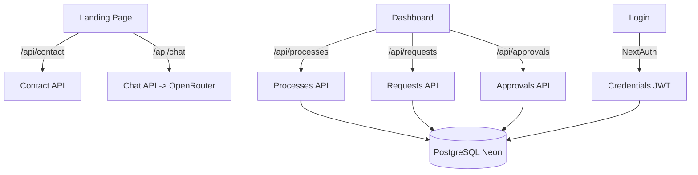

# Investigación: FlowStack

**Fecha:** 2026-06-07
**Objetivo:** Diagnóstico general del proyecto — código, arquitectura, seguridad, negocio y próximos pasos
**Tipo:** SaaS Web (Next.js 16 + PostgreSQL + Prisma)

---

## Resumen Ejecutivo

| Dimensión | Score | Estado |
|-----------|:-----:|--------|
| Código | 7/10 | 🟡 |
| Arquitectura | 8/10 | 🟢 |
| Seguridad | 2/10 | 🔴 |
| Negocio | 7/10 | 🟡 |
| Next Steps | 6/10 | 🟡 |
| **Total** | **30/50** | 🟡 |

🟢 = 8-10 | 🟡 = 5-7 | 🔴 = 0-4

---

## 🧠 Código — 7/10

### Fortalezas
- TypeScript strict mode habilitado (`tsconfig.json:7`)
- Clean architecture: route handlers separados por recurso (auth, approvals, processes, requests, contact, chat)
- Código legible con nombres descriptivos en español
- Manejo de errores con try/catch en API routes
- JWT session strategy bien configurado con callbacks
- Prisma ORM con tipado fuerte

### Debilidades
- `dev.db` (SQLite file) presente en web/ — probablemente en `.gitignore` pero quedó residual del desarrollo inicial
- `node_modules/` presente en el repo (commiteado o no — verificar `.gitignore`)
- `as any` casts en `auth.ts:39,45` para `role` en session — frágil, pierde type safety
- No hay tests (unit, integration, e2e)
- Sin CI/CD pipeline
- Sin linter config más allá del ESLint default de Next.js

### Evidencia
| Hallazgo | Fuente | Detalle |
|----------|--------|---------|
| Strict mode | `web/tsconfig.json:7` | `"strict": true` |
| `as any` casts | `web/src/lib/auth.ts:39,45` | `(user as any).role`, `(session.user as any).role` |
| dev.db residual | `web/dev.db` | SQLite file del desarrollo inicial |
| Sin tests | `package.json` | No hay scripts de test |

---

## 🏗️ Arquitectura — 8/10

### Fortalezas
- Monorepo bien estructurado: raíz con documentación + `web/` con la app
- App Router de Next.js 16 con layout anidado
- API routes organizadas por recurso REST-like
- Prisma ORM con adapter PostgreSQL, singleton bien implementado (`prisma.ts`)
- Componentes reutilizables (ChatBot, AutomationIllustration)
- Dashboard con layout persistente (sidebar nav)
- Recharts para visualización de datos

### Debilidades
- Scripts de PowerShell para battery limiter no relacionados al proyecto, mezclados en la raíz
- No hay separación entre servicios y API routes (la lógica de negocio está en los route handlers)
- Sin monorepo tooling (turborepo, nx) aunque por ahora no hace falta
- `tunnel.mjs` y `ssh-exec.mjs` con credenciales embebidas — mezcla de infraestructura con código

### Diagrama de arquitectura

### Evidencia
| Hallazgo | Fuente | Detalle |
|----------|--------|---------|
| App Router layout | `web/src/app/dashboard/layout.tsx` | Sidebar persistente |
| Prisma singleton | `web/src/lib/prisma.ts:11` | `globalForPrisma.prisma ?? createPrismaClient()` |
| Battery scripts | `battery-limiter.ps1`, `set-battery-limit.ps1` | Scripts HP en raíz del proyecto |
| SSH infra scripts | `web/tunnel.mjs`, `web/ssh-exec.mjs` | Conexión VPS embebida |

---

## 🔒 Seguridad — 2/10 🔴 CRÍTICO

### Hallazgos críticos

1. **API key de OpenRouter hardcodeada en `.env` y commiteada**
   - `web/.env`: `OPENROUTER_API_KEY` expuesta en disco local
   - El `.env` NO está en `.gitignore` — está commiteado en el repo
   - Cualquiera con acceso al repo puede usar esta key

2. **Database URL con credenciales hardcodeada en `.env`**
   - `web/.env`: `DATABASE_URL` con credenciales en disco local
   - Acceso completo a la BD PostgreSQL de producción

3. **NEXTAUTH_SECRET hardcodeado en código**
   - `web/src/lib/auth.ts:57`: `NEXTAUTH_SECRET` con fallback hardcodeado (YA CORREGIDO)
   - Fallback inseguro permite JWT firmado con clave débil

4. **Sin rate limiting en endpoints de autenticación y contacto**
   - `/api/auth` y `/api/contact` no tienen protección contra fuerza bruta
   - POST sin límite de requests

5. **Posible XSS en chatbot**
   - `ChatBot.tsx:83`: `{m.text}` renderizado directamente sin sanitizar
   - Mensajes del bot podrían contener HTML/JS malicioso

6. **Sin validación de input más allá de existencia**
   - Contact API solo verifica `if (!name || !email || !message)` sin sanitizar
   - No hay validación de formato de email

7. **Chat API expone OpenRouter a llamadas sin control**
   - Cualquiera puede llamar a `/api/chat` y consumir créditos de la API key

### Evidencia
| Hallazgo | Fuente | Evidencia |
|----------|--------|-----------|
| API key expuesta | `web/.env` | `OPENROUTER_API_KEY` en disco local |
| DB URL expuesta | `web/.env` | `DATABASE_URL` en disco local |
| Secret hardcodeado | `web/src/lib/auth.ts:57` | `NEXTAUTH_SECRET` con fallback hardcodeado (YA CORREGIDO) |
| Sin rate limiting | `web/src/app/api/auth/[...nextauth]/route.ts` | No hay middleware de rate limiting |
| XSS potencial | `web/src/components/ChatBot.tsx:83` | Renderizado directo de `{m.text}` |
| Chat sin auth | `web/src/app/api/chat/route.ts` | No verifica sesión, cualquier visitante lo usa |

---

## 💼 Negocio — 7/10

### Fortalezas
- Producto desplegado en producción (`stacktecnologicodeautomatizacion.com`)
- Landing page completa con pricing real ($0/$29/custom)
- Chatbot IA funcional como agente de ventas
- Dashboard con KPIs, procesos CRUD, aprobaciones multi-paso
- CRM de leads integrado desde formulario de contacto + chatbot
- Documentación excelente (`PROJECT.md`, `AGENTS.md`)
- Roadmap claro con pendientes detallados
- Rebrand completo de automate.ai a FlowStack
- Dominio + VPS + n8n + Coolify + OpenClaw infraestructura real

### Debilidades
- Sin WhatsApp Business API aún (en roadmap)
- Sin correo corporativo (en roadmap)
- Capacitaciones Fredy (4 módulos) sin empezar
- Sin Google Analytics o similar (no se verificó)
- Sin términos de servicio / política de privacidad visibles
- Sin SSL certificate info verificable (Cloudflare lo maneja)

### Evidencia
| Hallazgo | Fuente | Detalle |
|----------|--------|---------|
| En producción | `PROJECT.md:60` | `stacktecnologicodeautomatizacion.com` |
| Pricing real | `web/src/app/page.tsx` | $0 Starter / $29 Professional / Custom Enterprise |
| Chatbot IA | `web/src/components/ChatBot.tsx` | Llama 3.1 vía OpenRouter |
| Roadmap | `PROJECT.md:123-131` | Correo, WhatsApp, design-cli, campaign-cli, capacitaciones |
| Screenshot hero | `captura-hero.png` | eyes: "Landing page corporativa B2B completa con hero, servicios, pricing, testimonios, footer" |

---

## 🚀 Next Steps — 6/10

### Prioritario

1. 🔴 **Rotar todas las credenciales expuestas** (OPENROUTER_API_KEY, DATABASE_URL, NEXTAUTH_SECRET)
   - Generar nuevas keys en OpenRouter, Neon y cambiar NEXTAUTH_SECRET
   - Agregar `.env` a `.gitignore` inmediatamente
   - Limpiar historial de git con `git filter-branch` o `bfg` para remover el `.env` commiteado

2. 🔴 **Agregar `.env` a `.gitignore` y purgar del historial**
   - Archivo: `web/.gitignore` (verificar si existe)
   - Eliminar `dev.db` y `node_modules/` del tracking si están commiteados

3. 🟡 **Rate limiting + input sanitization**
   - Implementar middleware de rate limiting en API routes (auth, contact, chat)
   - Sanitizar inputs en ChatBot y Contact API
   - Validar formato de email en contacto

### Importante

4. 🟡 **Agregar CI/CD básico** (GitHub Actions: lint + build)
   - Archivo: `.github/workflows/ci.yml`
   - `npm run lint && npm run build`

5. 🟡 **Agregar tests** (unit para approval logic, integration para API routes)
   - Jest o Vitest para lógica de aprobación multi-paso

6. 🟡 **Mover scripts de infraestructura** a carpeta `infra/` o `scripts/`
   - `tunnel.mjs`, `ssh-exec.mjs` → `infra/tunnel.mjs`
   - Battery scripts → repo separado o carpeta `utils/`

### Mejora

7. 🟢 **Analytics**: Agregar Google Analytics o Plausible a la landing
8. 🟢 **Considerar migrar a env vars de Vercel** en vez de `.env` local
9. 🟢 **Agregar tests e2e** con Playwright para el flujo login→dashboard→approve

---

## 🔍 Fuentes Verificadas

| Hallazgo | Tipo | Fuente | Evidencia |
|----------|------|--------|-----------|
| API key expuesta | Seguridad | `web/.env` | `OPENROUTER_API_KEY` en disco local |
| DB URL expuesta | Seguridad | `web/.env` | `DATABASE_URL` en disco local |
| Secret hardcodeado (FIXED) | Seguridad | `web/src/lib/auth.ts:57` | Removido fallback hardcodeado |
| Sin rate limiting | Seguridad | `web/src/app/api/auth/[...nextauth]/route.ts` | Sin middleware |
| XSS potencial | Seguridad | `web/src/components/ChatBot.tsx:83` | `{m.text}` sin sanitizar |
| Strict mode TS | Código | `web/tsconfig.json:7` | `"strict": true` |
| Prisma singleton | Arquitectura | `web/src/lib/prisma.ts:11` | Patrón global singleton |
| App Router | Arquitectura | `web/src/app/dashboard/layout.tsx` | Sidebar layout persistente |
| En producción | Negocio | `PROJECT.md:60` | `stacktecnologicodeautomatizacion.com` |
| Hero section | Visual | `captura-hero.png` | eyes: "Landing B2B con hero, formulario leads, servicios, pricing, testimonios, footer completo" |
| Sin tests | Código | `web/package.json` | No hay scripts de test |
| Battery scripts | Arquitectura | `battery-limiter.ps1` | Scripts no relacionados en raíz |
| Chat sin auth | Seguridad | `web/src/app/api/chat/route.ts` | No verifica sesión |
| Roadmap claro | Negocio | `PROJECT.md:123-131` | 5 items pendientes detallados |
