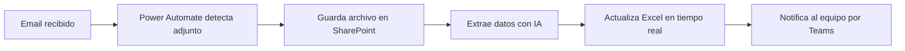

# Módulo 1: Power Automate & RPA

## Qué aprenderás
- Crear flujos de automatización con Power Automate
- Conectores, triggers y acciones
- RPA (Robotic Process Automation) con Power Automate Desktop
- Integración con SharePoint, Outlook, Excel, SQL

## Conceptos clave

### Power Automate (Cloud)
- **Flujos automatizados**: se disparan con un evento (email, archivo nuevo, etc.)
- **Flujos instantáneos**: se ejecutan manualmente desde un botón
- **Flujos programados**: se ejecutan en una fecha/hora específica

### Power Automate Desktop (RPA)
- Automatización de aplicaciones de escritorio
- Grabación de acciones del usuario
- Web scraping y extracción de datos

## Recursos
- [Documentación oficial Power Automate](https://learn.microsoft.com/power-automate/)
- [Power Automate Desktop](https://powerautomate.microsoft.com/desktop/)
- Tutoriales: buscar "Power Automate para empresas" en YouTube

## Ejemplo práctico

